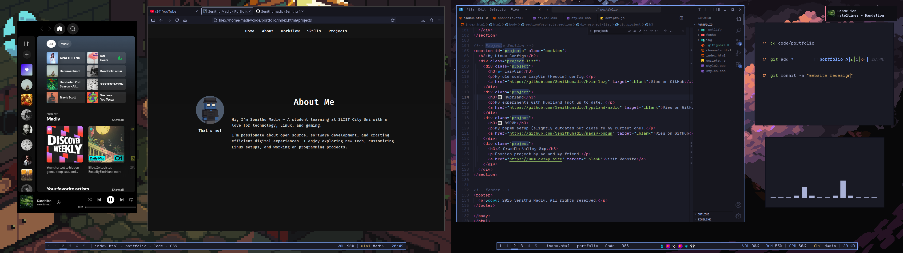

## Current Workflow  

› Laptop with external monitor running **Manjaro Linux** with **bspwm**, **j4-dmenu**, **Waterfox**, **Discord**, and **Code - OSS** (TokyoNight theme).  

### Apps I Use  

- [Manjaro Linux](https://manjaro.org/)  
- [BSPWM](https://github.com/baskerville/bspwm)  
- [j4-dmenu](https://github.com/enkore/j4-dmenu-desktop)  
- [Waterfox Browser](https://www.waterfox.net/)  
- [Code - OSS](https://archlinux.org/packages/extra/x86_64/code/)  
- [TokyoNight Theme](https://marketplace.visualstudio.com/items?itemName=enkia.tokyo-night)  
- [Spotify](https://open.spotify.com/)  

